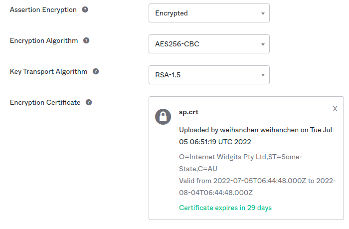

saml2-express-ts-sample
===

This Project is an example for saml2 integration with OKTA.

## self-signed certificate
If you need stronger security, please use credentials for mutual security verification

### generate service provider's cert
```sh
cd initial
openssl req -newkey rsa:4096 -x509 -nodes -sha256 -keyout sp.pem -out sp.crt
```

### upload to okta



## Identity Provider Configuration
- GET `/auth/saml2/metadata`: Metadata endpoint 
- POST `/auth/saml2/acs`: Assertion Consumer Service endpoint 
- GET `/auth/saml2/sls`: Single Logout Service endpoint 


## Service Provider Configuration

[🔍 Here](./.env)

