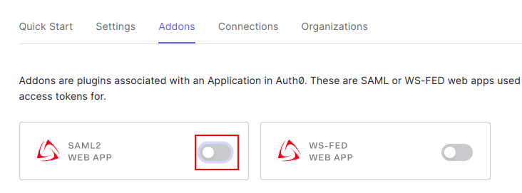
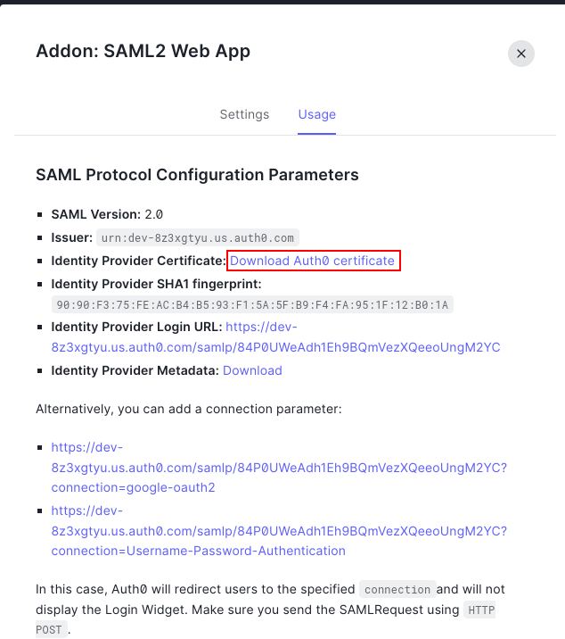
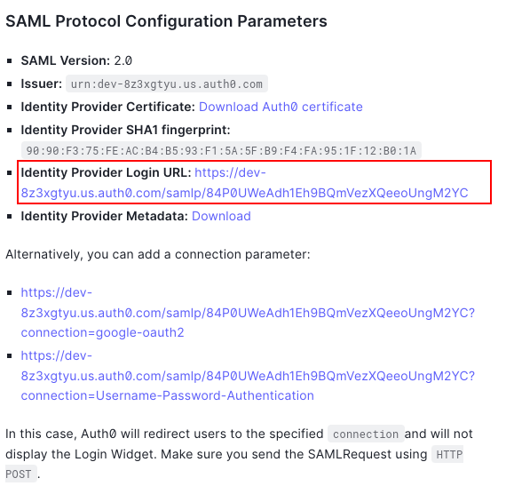
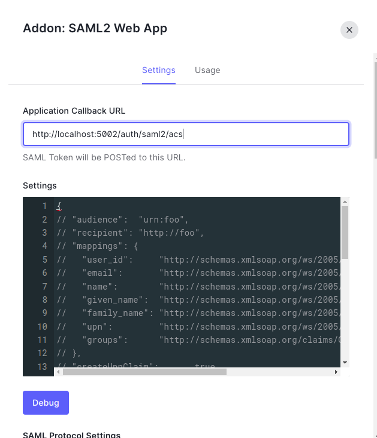
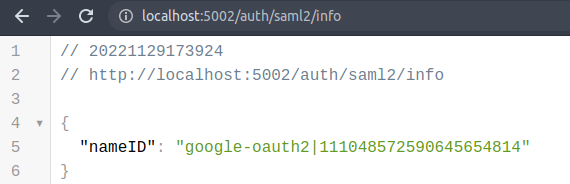

# Auth0 Configuration Example

- install cert to service provider.
- basic setting with auth0 login.
- ! idp not certificate with sp.

## Step 1: Create Application


## Step 2: SAML2 Addons



## Step 3: Download Certificate



Move certificate to initial/idp.cert

```bash
mv xxx.pem initial/idp.cert
```

## Step 4: Setting SAML2_IDP_SSO



.env

```
SAML2_IDP_SSO=https://dev-8z3xgtyu.us.auth0.com/samlp/84P0UWeAdh1Eh9BQmVezXQeeoUngM2YC
```


## Step 5: Setting Callback URL



## Step 6: Run Server

```bash
npm run start:dev
```

## Step 7: Open browser and test it


## Step 8: Login Success

